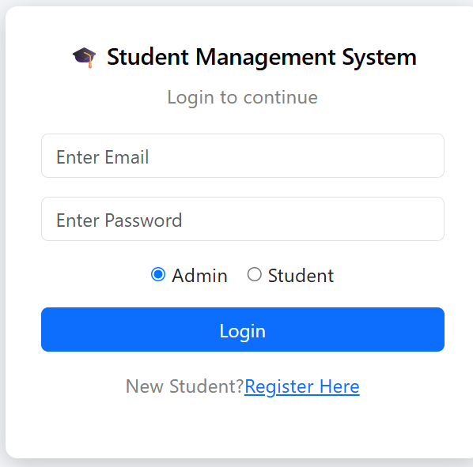
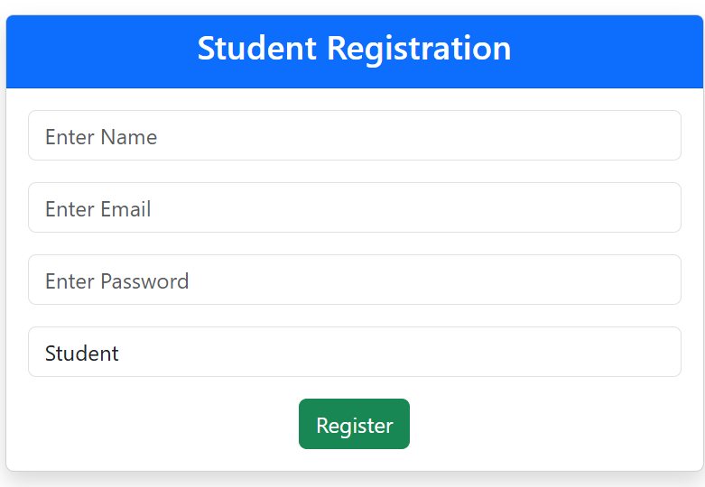
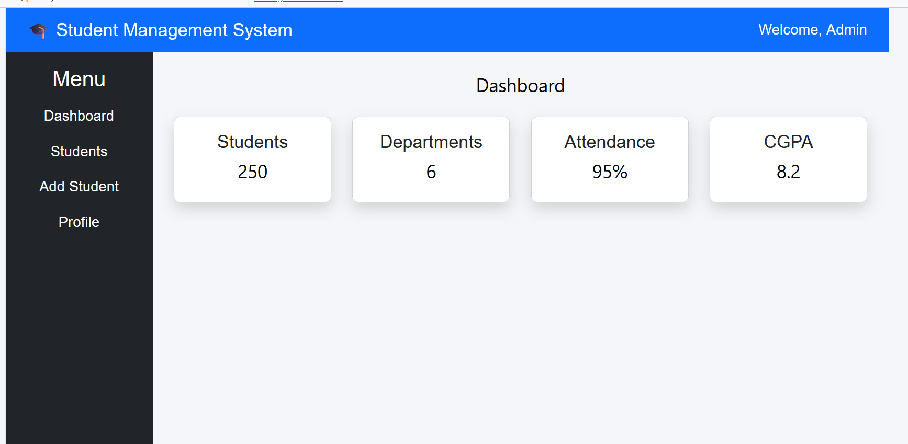
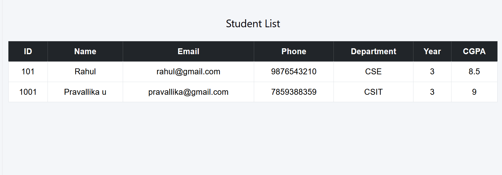
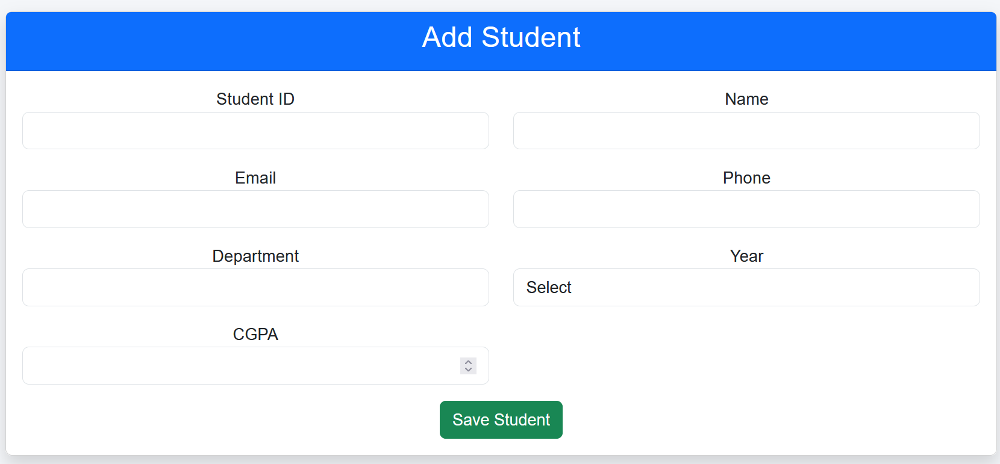
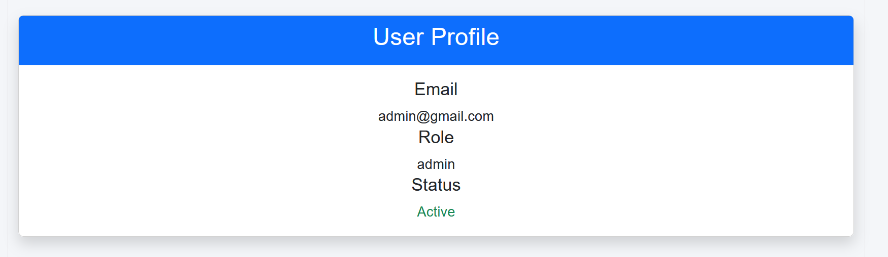

# 🎓 Student Management System

A full-stack web application developed to manage student information efficiently.  
The system provides user authentication, student registration, and student record management features with a modern React frontend, Node.js backend, and MongoDB database.

---

# 🚀 Live Demo

## Frontend

🔗 https://your-frontend-render-url.onrender.com


## Backend API

🔗 https://student-management-system-1-z46v.onrender.com

---

# 📌 Project Overview

The **Student Management System** is a web-based application designed to simplify the management of student records.

The application allows users to register, login, and access the system based on their roles.

The system supports two types of users:

- 👨‍💼 Admin
- 👨‍🎓 Student

Admin users can manage student information, while students can register and login to access their dashboard.

---

# ✨ Features

## 🔐 Authentication Module

- User Registration
- User Login
- Role-based authentication
- User-specific dashboard
- Welcome message with logged-in user's name


## 👨‍🎓 Student Management Module

Admin can:

- Add student details
- View student records
- Update student information
- Delete student records


Student information includes:

- Student ID
- Name
- Email
- Phone Number
- Department
- Year
- CGPA


## 📊 Dashboard Module

Features:

- User welcome message
- Navigation sidebar
- Dashboard cards
- Student information access

---

# 🛠️ Technology Stack

## Frontend

- React.js
- Vite
- React Router DOM
- Axios
- Bootstrap
- CSS


## Backend

- Node.js
- Express.js
- REST API


## Database

- MongoDB Atlas
- Mongoose


## Deployment

- GitHub
- Render
- MongoDB Atlas

---

# 📂 Project Structure

```
student-management-system

│
├── backend
│
│   ├── config
│   │   └── db.js
│   │
│   ├── controllers
│   │   ├── authController.js
│   │   └── studentController.js
│   │
│   ├── models
│   │   ├── User.js
│   │   └── Student.js
│   │
│   ├── routes
│   │   ├── authRoutes.js
│   │   └── studentRoutes.js
│   │
│   ├── server.js
│   └── package.json
│
│
└── frontend
    │
    ├── src
    │
    ├── api
    │   └── studentApi.js
    │
    ├── components
    │   ├── Navbar.jsx
    │   ├── Sidebar.jsx
    │   └── DashboardCard.jsx
    │
    ├── pages
    │   ├── Login.jsx
    │   ├── Register.jsx
    │   ├── Dashboard.jsx
    │   ├── StudentList.jsx
    │   ├── AddStudent.jsx
    │   ├── EditStudent.jsx
    │   └── Profile.jsx
    │
    ├── App.jsx
    └── package.json

```

---

# ⚙️ Installation and Setup

## Clone Repository

```bash
git clone https://github.com/pravallika1120/student-management-system.git
```

Go to project directory:

```bash
cd student-management-system
```

---

# Backend Setup

Navigate to backend:

```bash
cd backend
```

Install dependencies:

```bash
npm install
```

Create `.env` file:

```
PORT=5000

MONGODB_URI=your_mongodb_connection_string

JWT_SECRET=your_secret_key
```

Start backend:

```bash
npm start
```

Backend runs on:

```
http://localhost:5000
```

---

# Frontend Setup

Navigate to frontend:

```bash
cd frontend
```

Install dependencies:

```bash
npm install
```

Start frontend:

```bash
npm run dev
```

Frontend runs on:

```
http://localhost:5173
```

---

# 🔗 API Endpoints

## Authentication APIs

### Register User

```
POST /auth/register
```

Example:

```json
{
"name":"Mohan",
"email":"mohan@gmail.com",
"password":"Mohan123",
"role":"student"
}
```


### Login User

```
POST /auth/login
```

Example:

```json
{
"email":"mohan@gmail.com",
"password":"Mohan123",
"role":"student"
}
```

---

# Student APIs

## Get All Students

```
GET /students
```


## Add Student

```
POST /students
```


## Update Student

```
PUT /students/:id
```


## Delete Student

```
DELETE /students/:id
```

---

# 🗄️ Database Structure

## Users Collection

Stores:

- Name
- Email
- Password
- Role


## Students Collection

Stores:

- Student ID
- Name
- Email
- Phone
- Department
- Year
- CGPA

---

# 🌐 Deployment

## Backend Deployment

Platform:

**Render Web Service**

Backend URL:

```
https://student-management-system-1-z46v.onrender.com
```


## Frontend Deployment

Platform:

**Render Static Site**

---

# 📸 Screenshots

## 🔐 Login Page




## 📝 Registration Page




## 📊 Dashboard




## 👨‍🎓 Student List




## ➕ Add Student




## 👤 Profile Page



---

# 🔮 Future Enhancements

- Password encryption using bcrypt
- JWT authentication improvement
- Attendance management
- Student performance analytics
- Email notifications
- Profile management

---

# 👩‍💻 Developed By

**Pravallika Uppalapati**  
**Sai Prasanna Kampi**  
**Gangi Satyanarayana**  
**Haripriya Uppicherla**  
**Mohan Aakula**

### B.Tech Students

---

# 📄 License

This project is developed for educational purposes.
